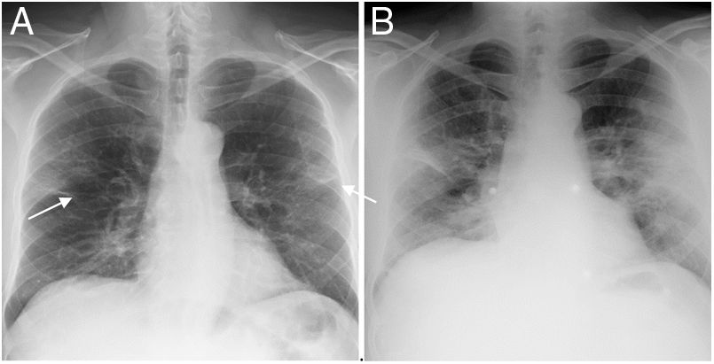

## Overview
This model was part of a larger project where a team built a machine learning pipeline for image classification. We leveraged the Kaggle pneumonia chest X-ray dataset, which contains labeled normal and pneumonia cases. Our pipeline consisted of a CNN autoencoder to extract latent vectors from the images, which were then fed into different machine learning models for classification.

## My Role
I designed a Vision Transformer in PyTorch that processed latent vectors, using self-attention mechanisms for binary image classification. The model achieved 77% overall accuracy and 98% recall on pneumonia cases. We felt that minimizing false negatives was more important than maximizing overall accuracy, effectively addressing class imbalance.

## Features
- Accepts latent vectors as input
- Computes probabilities for each class (pneumonia or not pneumonia)
- Trains, tests, and evaluates the model

## Technologies
Python, PyTorch, NumPy, scikit-learn

## Links
- 📖  [Project Repository](https://github.com/etowner/cs0451-pneumonia-detection)

